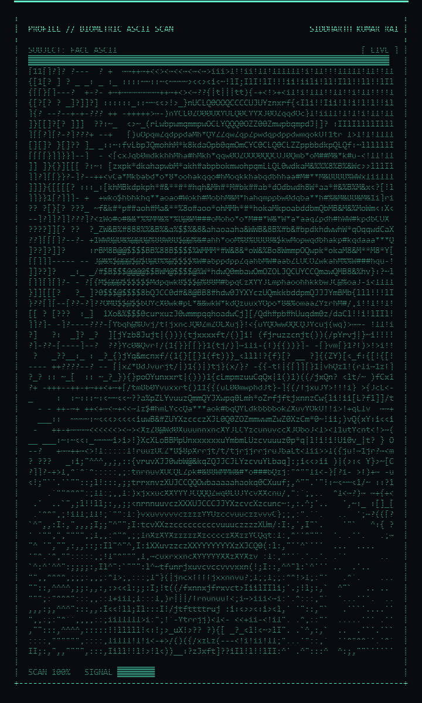

<table>
  <tr>
    <td width="50%" valign="middle" align="center">
      
    </td>
    <td width="50%" valign="top">
      <h2>Siddharth Kumar Rai</h2>
      <p><b>Product Engineer · Agentic AI &amp; Full-Stack · IoT &amp; Edge Automation</b></p>
      <p>
        Final-semester <b>BCA</b> student (IGNOU, Grade A++) freelancing as
        <b>Product Engineer · Electronics &amp; IoT</b> at <b>acreativestudios</b>.
        I don't just write code — I build complete, intelligent ecosystems from
        the ground up: <b>AI pipelines</b>, <b>backend systems</b>,
        <b>hardware automation</b> and <b>UI architecture</b>, all working
        together end to end.
      </p>
      <p>
        <b>Currently building</b><br/>
        🤖 <b>Sidd-V2</b> — local-first autonomous AI agent<br/>
        🦾 <b>VIEON</b> — tri-node embodied AI (ESP32 + Android + PC)<br/>
        🧩 <b>SkillsLMS</b> — full-stack learning platform
      </p>
      <p>
        <b>./scan --biometric</b> — live ASCII scan rendered from
        <code>assets/sidd image.jpeg</code> · regenerate:
        <code>python tools/generate_face_ascii.py</code><br/>
        📍 Greater Delhi Area, India · ✅ <b>open_to_work</b>
      </p>
      <p>
        <a href="https://github.com/siddharthkumarrai">GitHub</a> ·
        <a href="https://www.linkedin.com/in/siddharth-kumar-rai/">LinkedIn</a> ·
        <a href="https://siddyadav.vercel.app/">Portfolio</a> ·
        <a href="https://instagram.com/siddharthkumarrai777">Instagram</a> ·
        <a href="mailto:siddharthkumarrairai@gmail.com">Email</a>
      </p>
    </td>
  </tr>
</table>

---

### `./whoami`

```text
siddharth@world:~$ whoami
> ready_to_build --mode=agentic

📍 Location   : Greater Delhi Area, India
🎓 Education  : BCA (Software Technology), IGNOU — Grade A++
🎯 Focus      : Agentic AI · Full-Stack Dev · IoT Automation
💼 Currently  : Product Engineer (Freelance) @ acreativestudios
🔗 Portfolio  : siddyadav.vercel.app
📧 Email      : siddharthkumarrairai@gmail.com
✅ status     : open_to_work
```

---

### `./about`

<div align="center">
  
</div>

> I don't just write code — I build complete, intelligent ecosystems from the
> ground up: **AI pipelines**, **backend systems**, **hardware automation**,
> and **UI architecture**, all working together.
>
> Final-semester **BCA** student (IGNOU), freelancing as **Product Engineer ·
> Electronics & IoT** at **acreativestudios**. Community Leader at
> **CodeWithSidd**. Open to full-time roles.

```text
current_focus :
  - Agentic AI ..... LangChain · LangGraph · ChromaDB
  - Data / API ..... NumPy · Pandas · FastAPI
  - Product ........ Sidd-V2  (autonomous local-first AI agent)
  - Product ........ VIEON    (tri-node embodied AI · ESP32 + Android + PC)
  - Product ........ SkillsLMS (full-stack learning platform)
  - Building ....... reusable UI component library (WIP)
```

---

### `./stack`

<p align="center">
  
</p>

<p align="center">
  
  
  
  
  
  
  
  
  
</p>

---

### `./experience`

| Role | Company | Duration |
| :-- | :-- | :-- |
| **Product Engineer · Electronics & IoT** (Freelance) | acreativestudios | Feb 2025 – Present |
| Web Development Intern | Arista Vault Mw (Arivation Fashiontech) | Mar 2025 – Jun 2025 |
| Web Developer (Freelance) | Agnus Media | May 2024 – Jul 2024 |
| Backend Developer Intern | Sponsorgram | Mar 2024 – May 2024 |

---

### `./featured-builds`

<table>
  <tr>
    <td width="33%" valign="top">
      <h3 align="center">🧩 SkillsLMS</h3>
      <p align="center">Full-stack modern learning management system.</p>
      <p align="center">
        <a href="https://skillslms.vercel.app"></a>
        <a href="https://github.com/siddharthkumarrai/LMS"></a>
      </p>
    </td>
    <td width="33%" valign="top">
      <h3 align="center">🤖 Sidd-V2</h3>
      <p align="center">Local-first autonomous AI agent — Android edge node + Rust WebSocket server.</p>
      <p align="center">
        <a href="https://github.com/siddharthkumarrai/sidd-v2-assets"></a>
      </p>
    </td>
    <td width="33%" valign="top">
      <h3 align="center">🦾 VIEON</h3>
      <p align="center">Tri-node embodied AI — ESP32 humanoid + Android + PC.</p>
      <p align="center">
        <a href="https://github.com/siddharthkumarrai/-VIEON-Voice-Integrated-Embodied-Omni-Network"></a>
      </p>
    </td>
  </tr>
</table>

---

### `./stats`

<p align="center">
  
  
  
</p>

<p align="center">
  
</p>

---

### `./contact`

```text
github   : github.com/siddharthkumarrai
linkedin : linkedin.com/in/siddharth-kumar-rai
web      : siddyadav.vercel.app
email    : siddharthkumarrairai@gmail.com
```

---

<div align="center">
  <p><i>"Build things. Break things. Learn why."</i></p>
  <sub>scanned in ASCII · © 2026 Siddharth Kumar Rai</sub>
  <br/>
  
</div>
